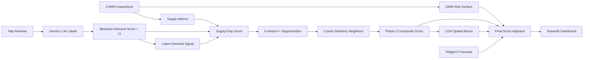

# System Design & Algorithmic Framework

**Project:** NYC Halal Market Intelligence & Opportunity Engine
**Team:** Amanda Dong (`yd2825`), Tony Zhao (`sz3822`), Harsh Agarwal (`ha2957`), Siqi Zhu (`sz3950`), Catherine Yi (`cgy2014`)

---

## Architectural Overview

The system is designed as a decoupled, 3-phase analytic pipeline where each stage performs a discrete transformation of the feature space. Intermediate outputs are serialized to Parquet/CSV, enabling any phase to be re-run independently without reprocessing upstream data. The final output feeds a Streamlit decision-support interface with zero re-computation on load (via `@st.cache_data`).

```
CS473-FML/
├── src/                         # Core Algorithmic Engine
│   ├── config.py                # Centralized ModelConfig (frozen dataclass)
│   ├── utils.py                 # Shared helpers: minmax, HALAL_CUISINES
│   ├── halal_demand.py          # Bayesian demand extraction & credible intervals
│   ├── halal_opportunity.py     # Multi-cuisine supply-gap & diversification metrics
│   ├── halal_kmeans.py          # k-means++ unsupervised segmentation
│   ├── halal_similarity.py      # Cosine-based contextual retrieval
│   ├── halal_risk.py            # GMM-based probabilistic risk modeling
│   ├── halal_forecast.py        # RidgeCV temporal growth prediction (lru_cache)
│   └── halal_spatial.py         # LISA spatial autocorrelation & Hot Spot detection
├── scripts/                     # Phase Runners & Orchestration
│   ├── run_phase1.py            # Market Characterization Pipeline
│   ├── run_phase2.py            # Contextual Retrieval & Scoring Pipeline
│   ├── run_phase3.py            # Risk-Adjusted Forecasting Pipeline
│   └── run_all.py               # Full-pipeline orchestrator with output validation
├── frontend/                    # Decision-Support Interface
│   ├── app.py                   # Streamlit entrypoint — tab navigation, filter state
│   ├── review_evidence.py       # Yelp review evidence retrieval by NTA
│   ├── methodology_content.py   # Methodology page content
│   └── components/
│       ├── theme.py             # Premium dark UI — glassmorphism, gold/green palette
│       ├── input_form.py        # Sidebar filter controls
│       ├── map_view.py          # MapBox opportunity map
│       ├── recommendation_card.py  # Per-NTA card: radar, gauge, decomposition, evidence
│       ├── results_panel.py     # Ranking panel + analytics deep-dive
│       └── comparison.py        # Side-by-side neighborhood comparison
├── tests/                       # Validation Framework
│   ├── conftest.py              # Shared fixtures
│   ├── test_config.py           # ModelConfig invariants
│   ├── test_halal_demand.py     # Demand shrinkage & credible interval tests
│   ├── test_halal_kmeans.py     # k-means++ convergence & initialization tests
│   ├── test_halal_opportunity.py # Supply-gap computation tests
│   ├── test_halal_risk.py       # GMM risk bucket tests
│   ├── test_halal_forecast.py   # RidgeCV + fallback path tests
│   └── test_run_all.py          # End-to-end pipeline integration tests
└── data/
    ├── raw/                     # Yelp text, Gemini labels, CAMIS records, NTA boundaries
    ├── processed/               # Parquet-optimized hygiene features
    └── output/                  # Serialized analytic outputs (CSV)
```

---

## Data Flow



---

## Methodological Deep-Dive

### Phase 1 — Market Characterization & Clustering

**Demand Estimation (Bayesian Shrinkage)**

The core demand signal is computed via Beta-Binomial conjugate inference. Given `halal_count` halal reviews out of `total_reviews`, the shrunk demand share is:

```
shrunk_share = (halal_count + α × global_mean) / (total + α)
```

where α = 10 acts as a prior pseudo-count derived from the global halal share. This prevents low-volume NTAs from being dominated by stochastic noise — the "cold start" problem common in collaborative filtering.

Per-NTA **80% credible intervals** are computed via `scipy.stats.beta.ppf(0.1, h+1, n-h+1)` and `ppf(0.9, ...)`, where h and n are the observed counts (no rounding — the Beta distribution accepts float parameters). Wide CI = low-signal NTA; narrow CI = reliable estimate.

**Latent Demand Signal**

A composite score built from three supply-independent proxies:
- `explicit_count / total_reviews` — fraction of reviews with explicit halal labels
- `implicit_score` — keyword scan density (halal, zabiha, no pork, etc.)
- `activity_weight` — log-normalized review volume as neighborhood engagement proxy

These are blended with weights (60% explicit/implicit, 40% activity) and min-max normalized to [0, 1].

**k-means++ Segmentation**

Custom implementation in `halal_kmeans.py` with vectorized NumPy distance computation. The k-means++ initialization seeds centroids with probability proportional to squared distance from existing centroids:

```python
dists = sq_dists.min(axis=1)
probs = dists / dists.sum()
next_idx = rng.choice(len(X), p=probs)
```

A zero-total guard handles degenerate cases. Model selection via elbow + silhouette analysis over k ∈ [2, 8]; k=4 chosen for distinct market tier separation. **Cluster confidence** is computed as the centroid separation ratio to quantify assignment reliability.

**Output Market Segments**

| Segment | Interpretation |
|---------|---------------|
| High Opportunity | High demand, low supply — primary entry targets |
| Growing Market | Moderate demand, rising trajectory |
| Established Hub | High supply density — competitive but proven |
| Low Demand | Low signal — requires further investigation |

---

### Phase 2 — Contextual Retrieval & Scoring

**Cosine Similarity Profiling**

For each NTA, cosine similarity is computed against all other NTAs over the feature vector `[demand_score, halal_supply_rate, gap_score, viability_score]`. The top-3 most similar NTAs are surfaced as "look-alike" neighborhoods — used both in the recommendation card and as a market analogies signal.

**Composite Opportunity Score**

```
final_score = 0.40 × demand_score + 0.40 × gap_score + 0.20 × viability_score
```

Weights reflect the relative importance of unmet demand over operating safety for early-stage entry decisions. All component scores are min-max normalized to [0, 1] prior to composition.

**Supply Gap Formulation**

```
combined_demand = 0.60 × demand_score + 0.40 × latent_demand_score
gap_score = clip(combined_demand − supply_norm, lower=0)
```

The 60/40 blend balances revealed demand (from current review patterns) with latent demand (supply-independent signal), before clipping negative gap values to zero (a positive gap is the only actionable signal).

---

### Phase 3 — Risk & Forecasting

**GMM Risk Surface**

A 4-component Gaussian Mixture Model (BIC-selected over n ∈ {2, 3, 4}) is fit on z-scored inspection features: `[critical_rate, grade_a_rate, inspection_frequency, demand_score, halal_supply_rate]`. Components are ranked by critical violation rate; the top-2 components define "high risk."

```
high_risk_prob = Σ P(component_k | NTA)   for k in high_risk_components
```

This yields a continuous risk density rather than binary classification — enabling the final score adjustment:

```
final_score_adjusted = final_score × (1 − 0.15 × high_risk_prob) × (1 + 0.10 × forecast_norm)
```

**RidgeCV Forecasting**

Two cross-validated Ridge models (alpha ∈ [0.001, 0.01, 0.1, 1.0, 10.0, 100.0], 5-fold KFold):

- `build_forecast()` — predicts 2024 halal_related_share from 2022 NTA signals + supply features; trains on NTAs with ≥3 reviews in both years
- `build_entry_forecast()` — predicts new halal merchant count from 2023 review momentum and existing supply

Both include: ablation tables (leave-one-feature-out CV), persistence baselines (naive "same as last year"), and in-sample R² diagnostics. A fallback path handles cases where insufficient NTAs have overlapping years of data.

`_load_yearly_nta_signals()` is decorated with `@functools.lru_cache(maxsize=1)` to prevent double CSV reads when both forecast functions are called in the same process.

**LISA Spatial Bonus**

Local Moran's I is computed via `libpysal.weights.KNN.from_array(coords, k=5)` and `esda.Moran_Local(gap_score, w, permutations=999)`. NTAs in the **Low-High (LH) quadrant** — underserved but surrounded by high-demand neighbors — receive an 8% final score boost:

```
final_score_adjusted *= (1 + 0.08 × lisa_opportunity)
```

Statistical significance is filtered at p < 0.05 (permutation-based pseudo p-value).

---

### Phase 4 — Active Research Directions

**Neural Demand Embeddings**

We are prototyping the replacement of the keyword/LLM-label signal with **fine-tuned sentence transformer embeddings** (e.g., `all-MiniLM-L6-v2` fine-tuned on explicit_halal / not_related pairs). This would produce a continuous semantic "halal interest intensity" score per review, enabling richer NTA-level aggregation beyond binary label counts.

**Spatial Autoregressive Models (SAR)**

The current LISA bonus is a heuristic. We are developing a **Spatial Lag Model (SLM)** that explicitly includes the spatially-lagged demand score as a predictor in the composite score, allowing the model to learn the degree of spillover from neighboring NTAs rather than applying a fixed 8% multiplier.

**Dynamic GMM via Hidden Markov Models**

The GMM risk model is a static snapshot. A **Hidden Markov Model** over yearly inspection summaries would capture risk trajectory — an NTA transitioning from High → Low risk is a better entry signal than one that has been consistently Low. This is a meaningful upgrade for multi-year strategic planning.

---

## Frontend Architecture

### Navigation & State

The dashboard uses a **3-tab layout** with a persistent left sidebar for filter controls. Filter state (borough, market type, risk tolerance, result limit) is evaluated once per rerender and passed down to all tab views. `@st.cache_data` is applied to data loading functions — the pipeline CSVs are read once per session regardless of tab navigation.

### Recommendation Card (per NTA)

Each card renders six sub-components:
1. **Header**: Display name (resolved from NTA ID → zone lookup), borough, market type badge
2. **Radar Chart**: 5-axis Plotly Scatterpolar — Halal Demand, Market Gap, Operating Safety, Low Risk, Future Trend
3. **Score Gauge**: Plotly Indicator gauge for the overall fit score
4. **Metrics Row**: Demand signal label, gap label, latent demand label, risk bucket
5. **Plain-English Summary**: Auto-generated from signal thresholds and market type
6. **Expandable Sections**: Score decomposition (SHAP-style bar), review evidence (Yelp + Gemini labels), risk detail, next-year outlook, similar neighborhoods

### Comparison View (Tab 2)

A side-by-side **portfolio analysis tool**: users select any two neighborhoods from their shortlist. The view renders dual radar charts, delta metrics (`st.metric` with signed deltas), and a narrative synthesis explaining which neighborhood leads in which dimension.

### Analytics View (Tab 3)

Institutional-grade market analytics: box plot score distribution by market segment, demand-vs-gap scatter for strategic positioning, and a full sortable data table of the complete model output.

---

## Evaluation Framework

| Metric | Target | Notes |
|--------|--------|-------|
| Silhouette Score | > 0.35 | k-means++ cluster separation |
| GMM Silhouette | > 0.30 | Risk surface coherence |
| Forecast R² (in-sample) | > 0.50 | Vs. persistence baseline |
| Moran's I p-value | < 0.05 | LISA significance filter |
| CI Width (80%) | Tracked | NTA uncertainty signal |

The `tests/` suite covers: ModelConfig invariants, Bayesian shrinkage edge cases (zero reviews, all-halal), k-means++ initialization properties, supply-gap computation, GMM risk bucket correctness, RidgeCV fallback path, and end-to-end pipeline output validation.

---

## Division of Labor & Module Ownership

| Specialist | Primary Domain & Module Responsibility |
| :--- | :--- |
| **Amanda Dong** | **UX Architecture & Visualization**: Leads the Streamlit interface design (`frontend/app.py`, `components/theme.py`). Responsible for the tab layout, recommendation card UX, radar chart + score gauge implementation, and the comparison view. |
| **Catherine Yi** | **Probabilistic Modeling & Forecasting**: Architect of the Phase 3 pipeline. Owns the GMM risk surface (`src/halal_risk.py`) and both RidgeCV growth models (`src/halal_forecast.py`). |
| **Harsh Agarwal** | **Data Engineering & Hygiene Quality**: Steward of the CAMIS inspection pipeline. Owns `src/halal_opportunity.py`, supply-gap formulation, and the `ModelConfig` centralization (`src/config.py`). |
| **Siqi Zhu** | **NLP & Demand Signal Engineering**: Owns the Yelp ↔ Gemini ingestion logic (`src/halal_demand.py`). Responsible for the Bayesian shrinkage implementation, credible interval computation, and latent demand signal extraction. |
| **Tony Zhao** | **Unsupervised Learning, Spatial Analysis & Ranking**: Executes the k-means++ segmentation (`src/halal_kmeans.py`), the Phase 2 similarity/ranking engine (`src/halal_similarity.py`), and the LISA spatial module (`src/halal_spatial.py`). |
